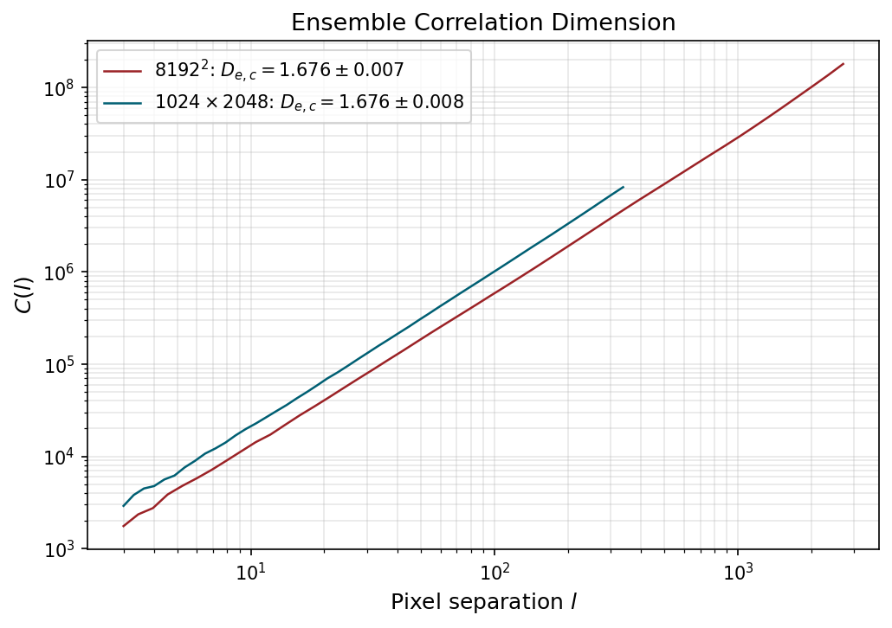
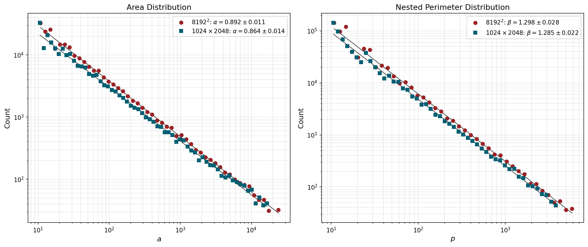
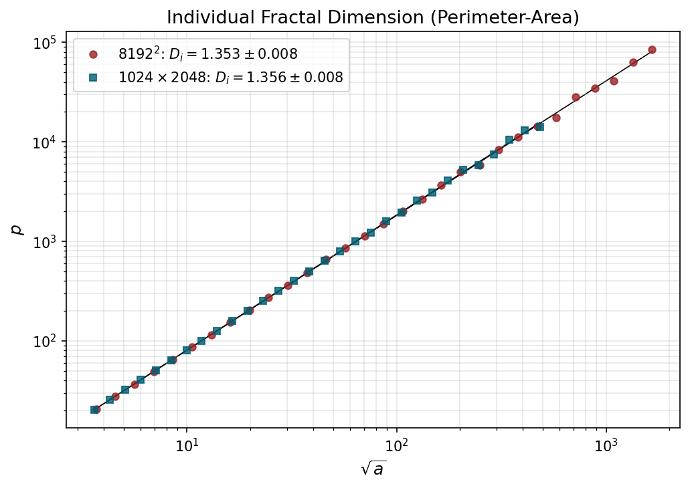
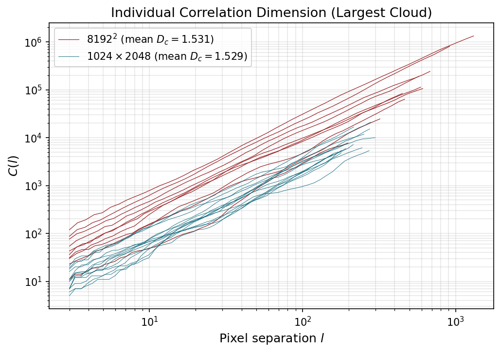

# MODIS data clones using multifractal simulations

This repo contains code to produce synthetic cloud masks using the FIF algorithm proposed by Lovejoy and Shertzer (2010), implemented via the Python package [`scaleinvariance`](https://github.com/thomasdewitt/scaleinvariance). 

To construct cloud masks, I first simulate 30 $16384^2$ FIF simulations using Hurst exponent $H=0.25$, codimension of the mean $C_1=0.05$, and multifractal index $\alpha=1.8$. These values are close to those observed for reflectivity fields. Next, the simulation is subsampled by dropping every other point along both axes to obtain arrays of size $8192^2$. These arrays are saved in `output/large/` in `.npy` format. The subsampling step is necessary to reduce numerical error present at small scales in FIF simulations. The arrays of size $8192^2$ are made binary such that points with a value greater than the ensemble mean are set to cloudy and the rest to clear. Finally, the full-size cloud mask is divided into $4\times 8$ individual scenes, each representing a simulated MODIS cloud mask. Individual resulting cloud masks have shape $1024\times 2048$, which is close to individual MODIS granules which have shape $1354\times 2030$.

The approach of initially constructing a larger simulation, before dividing it into subscenes, ensures that variability is present at a larger scale than an individual scene as is realistic for MODIS images which have a footprint of approximately $2000\,\textrm{km}\times 2000\,\textrm{km}$. The large-scale variability present in the 8192$^2$ simulations is analogous to planetary- and synoptic- scale variability present in Earth's weather above $~2000\,\textrm{km}$.

For a 2D intermittent multifractal thresholded at its mean, the theoretical value for the ensemble fractal dimension is $D_e \approx 2-H = 1.75$ with intermittency corrections that depend on $C_1$ and the method used to compute the fractal dimension.

To determine whether MODIS scenes are well resolved enough that discretization effects do not contaminate the result, I compute fractal parameters using the Python package [`objscale`](https://github.com/thomasdewitt/objscale) for the full 8192$^2$ cloud masks and compare the results to those obtained from the subsetted $1024\times 2048$ cloud masks. The underlying data are identical, so any discrepancy arises purely from finite domain effects. Although `objscale` is designed to mitigate any discrepancy, perfection cannot be expected.

First, we compare the ensemble correlation dimension $D_{e,c}$ for the original and subsetted cloud masks. Because the correlation integral is estimated for pixel separation distances $l$ between 3 pixel widths and 1/3 of the domain size, the large domain cloud masks show a wider range of $l$.

Estimates of $D_{e,c}$ are $1.676\pm 0.007$ for the full $8192^2$ masks and $1.676\pm 0.008$ for the $1024\times 2048$ sub-scenes.

Size distributions of cloud areas and perimeters also produce relatively close values between the sub-scenes and the original:

Individual fractal dimension using the filled perimeter-area method:

Individual unfilled correlation dimension of the largest cloud in a single image:

